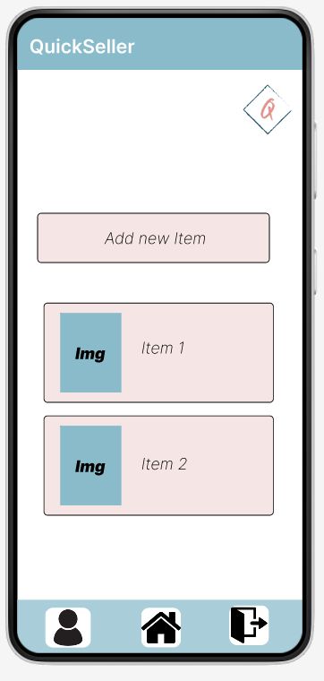

# QuickSeller

## Team Members 
- Haya Hassan
- Marwa Hussein
- Mohammad Darwish
- Mohammad Samara
- Musab Khalifeh 

______

## Introduction 

QuickSeller is a mobile application designed to facilitate the buying and selling of new and used items among customers. The platform aims to provide a user-friendly and secure environment for users to engage in transactions with ease.

______

## Why the App is useful?

- Users can conveniently buy and sell used items from the comfort of their homes.
- Buyers can find affordable deals on second-hand items.
- Offers a diverse range of used items, from furniture and electronics to clothing and accessories, providing users with a wide selection.
- The app allows users to browse and shop at any time, providing 24/7 accessibility.

______

## Key Features 

1. User Registration and Authentication: Users can register and log in securely to access the system. Authentication and authorization mechanisms ensure data privacy and security.

2. Items Management: Items can be categorized (e.g., Electronics, Clothes, Perishable Goods,Office supplies).

3. Adding Items to Sell : User can add his own item as post to sell for buyers.

4. Buyers Comments : As A buyer user can add comment on specific post at ask about item displayed in the post and seller can reply.

5. User Profiles: Users can create and manage their profiles, including their usernames, full-names, phones numbers, and emails.

______

## User Stories

### User Story 1: User Registration
Title: User Registration
User Story sentence: As a new user, I want to create an account to buy or sell products.
Feature Tasks:
Create a registration form with fields for username, email, password, and additional relevant information.
Implement validation for unique usernames and valid email formats.
Send a confirmation email for account verification.
Acceptance Tests:
Users can successfully register by providing valid information.
Users cannot register with an existing username or invalid email format.

### User Story 2: Product Listing
Title: Product Listing
User Story sentence: As a seller, I want to list products for sale with details and images.
Feature Tasks:
Create a form to add product details such as name, description, price, category, and images.
Implement image upload functionality.
Allow sellers to edit or delete their listed products.
Acceptance Tests:
Sellers can add new products with all required details.
Images are successfully uploaded and displayed with the product information.
Sellers can edit or remove their listed products.

### User Story 3: Product Search and Filter
Title: Product Search and Filter
User Story sentence: As a buyer, I want to search and filter products based on categories and keywords.
Feature Tasks:
Implement a search bar with autocomplete suggestions.
Create filters by category, price range, and other relevant attributes.
Display search results and filter options dynamically.
Acceptance Tests:
Users can search for products using keywords that match product names or descriptions.
Filters refine search results accurately based on selected criteria.

### User Story 4: User Profile Management
Title: User Profile Management
User Story sentence: As a user, I want to manage my profile and view past orders.
Feature Tasks:
Create a user profile section displaying personal information and past orders.
Allow users to update their profile information and change passwords.
Provide a section to view order history and status.
Acceptance Tests:
Users can update their profile information and change passwords.
Users can view their order history with details and order statuses.

### User Story 5: Buyer-Seller Communication
Title: Buyer-Seller Communication
User Story sentence: As a seller, I want to communicate with potential buyers to discuss product details or negotiations.
Feature Tasks:
Implement a commenting system between buyers and sellers within the platform.
Allow sellers to respond to buyer inquiries.
Acceptance Tests:
Sellers can reply comments to interested buyers regarding product inquiries.
Buyers receive new replies from Sellers

______

## Software Requirements

[Read Here](/requirments.md)

______

## Prerequisites 

- Java Development Kit (Sdk)
- Android Studio 
- Gradle
- Aws Amplify 
- Aws DynamoDB, Aws S3, AWS Cognito
______

## Trello Board

[Click Here](https://marwahus.atlassian.net/jira/software/projects/JIR/boards/3)

______

## Wireframes

### **Logo**

### **Welcome Page**

### **Signup Page**

### **Verify Account Page**

### **Login Page**

### **Profile Page**

### **Edit Profile Page**

### **Home Page**

### **Add Item Page**

### **Item Details Page**

### **Logout Page**

## Domain Modeling and Schema

1. Entities:

- Product
Properties: id, name, description, dateCreated, productCategory, productImageS3Key, productLatitude, productLongitude, userId
Relationships: userPerson (belongsTo User), orders (hasMany OrderProduct), comments (hasMany Comment)

- User
Properties: id, email, fullName
Relationships: products (hasMany Product), orders (hasMany Order), comments (hasMany Comment)

- Order
Properties: id, orderDate, orderStatus, userId
Relationships: products (hasMany OrderProduct), user (belongsTo User)

- Comment
Properties: id, content, createdAt, productId, userId
Relationships: product (belongsTo Product), user (belongsTo User)

- OrderProduct
Properties: id, orderId, productId, quantity
Relationships: order (belongsTo Order), product (belongsTo Product)

2. Relationships:
Product has a one-to-many relationship with OrderProduct and Comment.
User has a one-to-many relationship with Product, Order, and Comment.
Order has a one-to-many relationship with OrderProduct and belongs to a User.
Comment belongs to both Product and User.
OrderProduct belongs to both Order and Product.

3. Database Schema Diagram: 
Collections (Tables):
- Product
Properties: id (ID), name (String), description (String), dateCreated (AWSDateTime), productCategory (ProductCategoryEnum), productImageS3Key (String), productLatitude (String), productLongitude (String), userId (ID)
Relationships: userPerson (belongsTo User), orders (hasMany OrderProduct), comments (hasMany Comment)

- User
Properties: id (ID), email (String), fullName (String)
Relationships: products (hasMany Product), orders (hasMany Order), comments (hasMany Comment)

- Order
Properties: id (ID), orderDate (AWSDateTime), orderStatus (OrderStatusEnum), userId (ID)
Relationships: products (hasMany OrderProduct), user (belongsTo User)

- Comment
Properties: id (ID), content (String), createdAt (AWSDateTime), productId (ID), userId (ID)
Relationships: product (belongsTo Product), user (belongsTo User)

- OrderProduct
Properties: id (ID), orderId (ID), productId (ID), quantity (Int)
Relationships: order (belongsTo Order), product (belongsTo Product)

